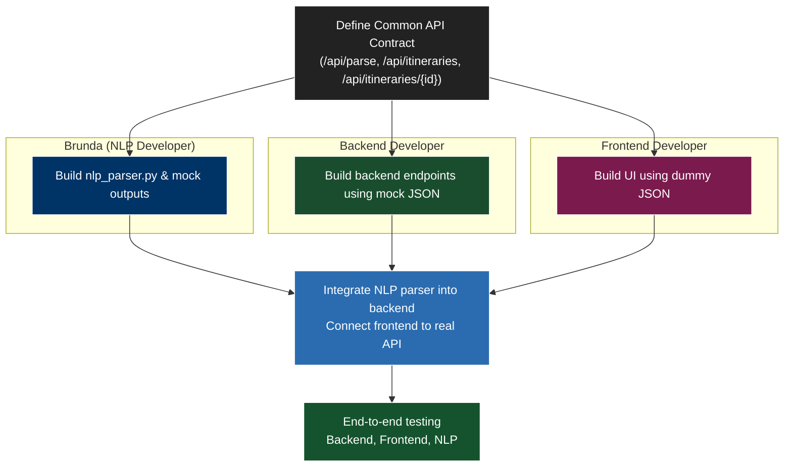

# AI Travel Planner – Phase 2 Work Distribution & Visual Workflow

Here’s a visual version of the workflow using **Mermaid** diagrams, which can render directly in GitHub, VS Code, or any Mermaid live editor.

> **VS Code Users:** To render Mermaid diagrams in the Markdown preview, install the **"Markdown Preview Mermaid Support"** extension from the Extensions panel (`Ctrl+Shift+X`). After installation, open the Markdown preview (`Ctrl+Shift+V`) to see the diagram.

You can also view the diagram in a browser using [Mermaid Live Editor](https://mermaid.live/).

